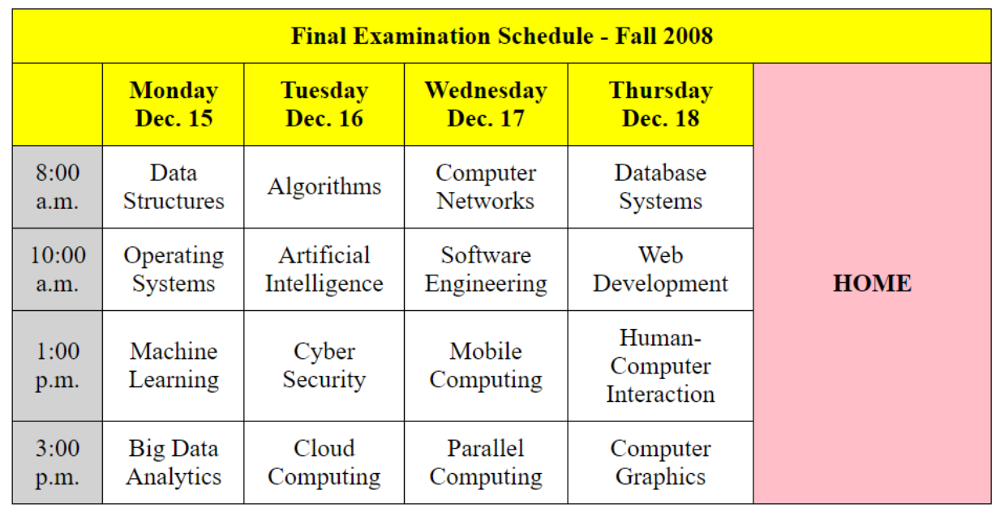

## HTML Table Assignment

- Goal: Create an HTML table layout identical to the one in the provided image.
- Image Reference: Use the following image as a reference for your table structure and styling

- Steps:
HTML Structure:
1. Create a basic HTML structure.
2. Use the ```<table>, <thead>, <tbody>, <tr>, <th>, and <td>``` elements to replicate the table structure.
3. Ensure to include appropriate headers and data cells to match the provided image.

CSS Styling:
1. Apply CSS to style the table, ensuring it matches the appearance of the provided
image.
2. Use CSS properties such as border, padding, background-color,
text-align, etc., to achieve the desired look.
